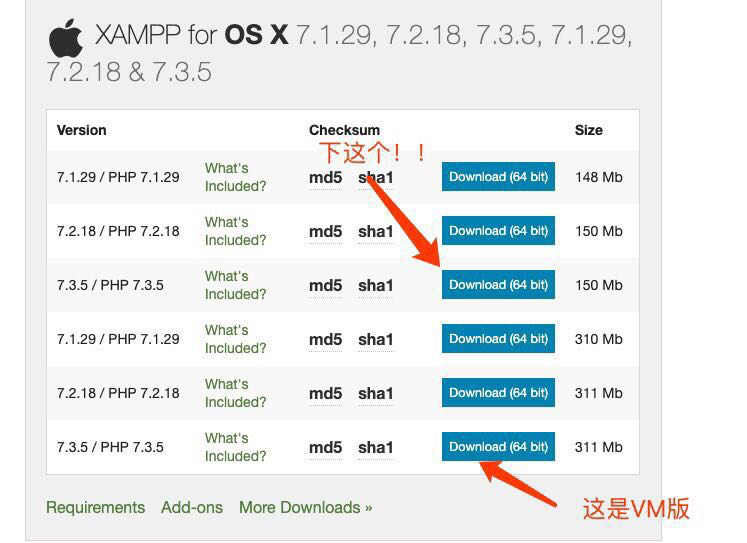

# ❤️Mac OS中xampp下载中的坑❤️

​		最近也是开始在折腾php了，php代码的运行必须要基于服务器的，所以我也是找了一个比较傻瓜式的服务器，但是，在安装的时候还是出问题了，尴尬～😅😳

​		**踩坑描述：**正常下载安装，启动服务以后，点击**go to application**，就会弹出网页，但是，问题来了，为毛我点击网页右上角的**phpmyadmin**就会报错，整了半天虽然解决了问题，但是，问题的根源不在这里，问题的根源是在xampp版本的问题，Mac OS有六个版本，上边三个是mac OS版本的，下边三个是vm版的，如果不小心下载了vm版的，那就尴尬了，额，好吧，我就是看着这个311M的大，想着可能更全，就整错了，vm版的xampp是要基于虚拟机的，所以直接安装在mac os中会报错，很无奈，很尴尬，希望大家引以为戒吧！❤️笔芯❤️

有时候，大的不一定好使，浓缩的才是精华，咳咳，在这里不能这么说，应该是，合适的才是最好的～

[Mac OS中xampp下载安装遇到的坑]: ./MacOS中xampp下载安装遇到的坑.md

