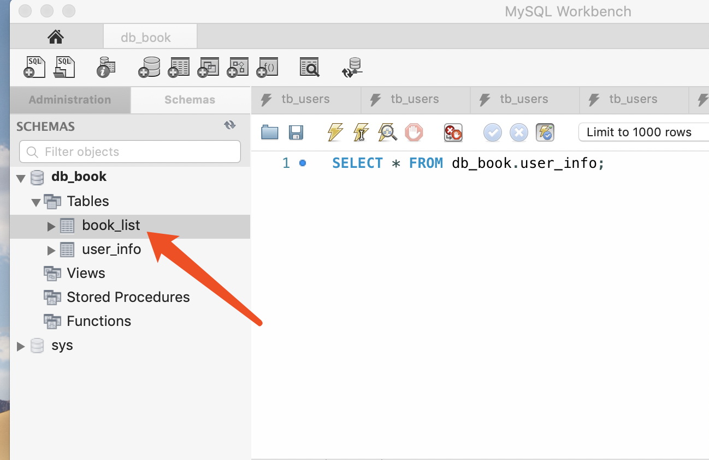

# ❤️yii2踩坑之数据表命名规则❤️

**😓开局先说一句mmp，今天的坑踩的是很无奈啊～**

​		众所周知，Yii 是一个高性能、快速、安全、专业的，适用于开发 WEB 2.0 应用的 PHP 框架，所以作为小白的我也是决定拿他来练手，但是，第一天用我就踩了一个大坑，问了度娘千百次也没解决，最后，还是我召唤了皮卡丘才解决的😉～

#### 一路踩坑：

​		今天在测试从数据库拿数据的时候，突然发现页面报错，我在models里写了数据模型，然后在controllers写了控制器，想在页面打印数据，先看代码

**这是数据模型**

**这是控制器**

**这是数据库及数据表名**

**这是结果**

​		到了这一步，我就开始问度娘，问朋友，问资深老农，都没给出解决办法～这可咋整

​		没办法，自己折腾呗，我总感觉是数据表名称的问题，但是我把数据表名**t_list**改成**test**就可以，虽然可以解决，但是，我明明记得可以这样命名啊，数据表加前缀～然后我灵机一动～前方高能！！注意！！⚠️

​		😝**我把数据表名改成了tb_list，然后模型名写成了TbList ，OK，完美解决！！**

那么，问题来了，如果你非要写t_list，那该怎么办呢？这个也不用凉拌，经过我将近半小时的鼓捣，终于整明白了，如果你非要将数据表命名成**t_list**，那你只能将数据模型名称改为**T_list**，**其他都不行，都会报错！！**

**现在是这样，不会报错**

虽然不报错，但是是不是感觉怪怪的？格式不统一，是吧？

所以，寡人在这里建议一下哈，为了避免yii2的这个坑，大家还是使用比较优美的命名吧，比如，这样式儿的：

到这里，这个坑算是踩的明明白白的了，小白一枚，每天在踩坑，如有问题，希望大家批评指正～❤️笔芯❤️